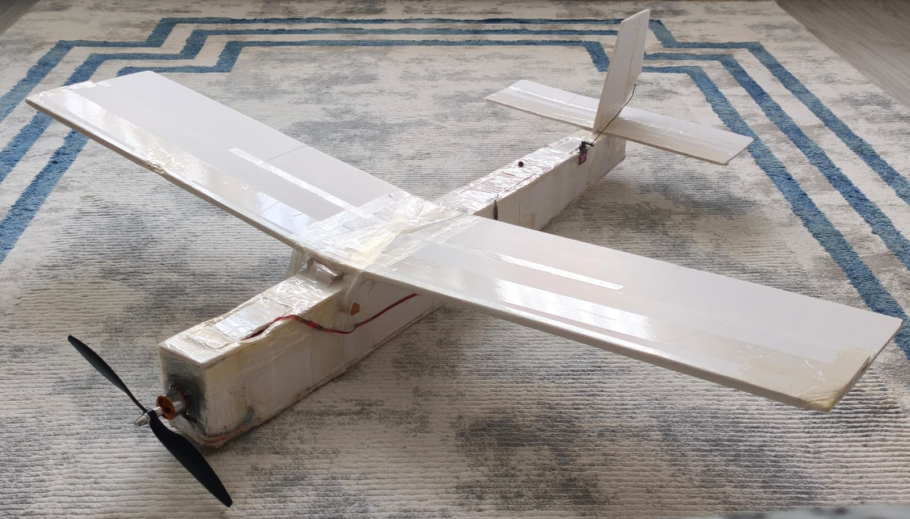
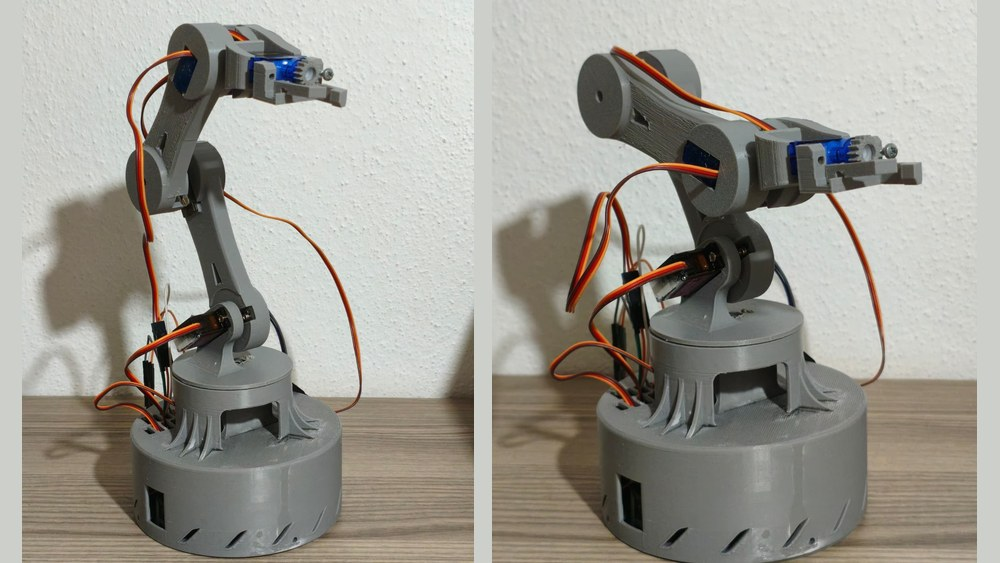
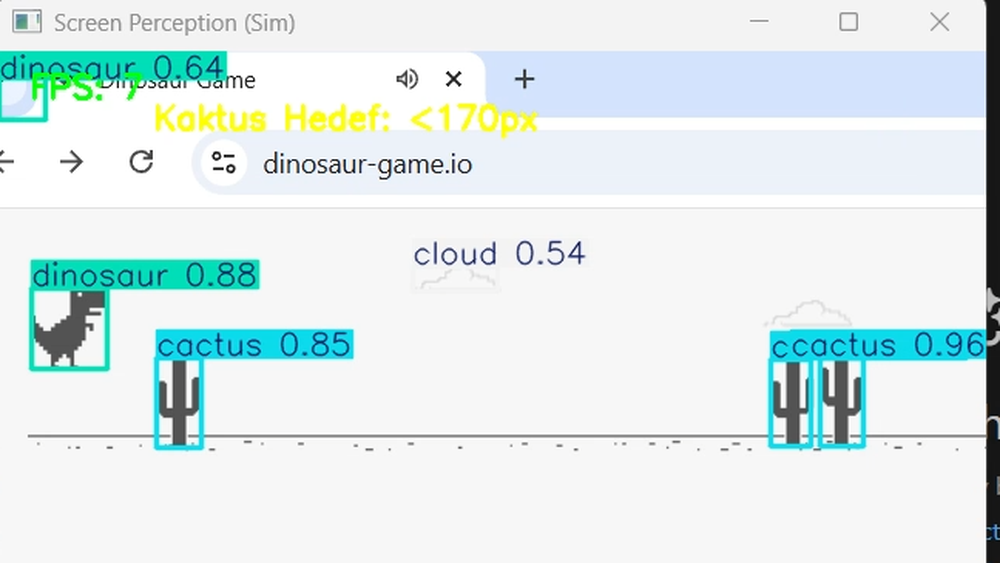

  

<h3 align="center">Eray Fazıl Ordanuç</h3>

  Mechatronics Engineering student at <b>Yıldız Technical University</b> 
  I build systems end to end — the hardware, the firmware that drives it, and the interface that talks to it.

  
  

 

### Currently

Building software at **Orinium** — autonomous fixed-wing UAV for TEKNOFEST.
Mission state machine in Python/pymavlink over ArduPlane, Gazebo/SITL validation loop,
Pixhawk integration and flight testing. Writing custom STM32 flight control firmware on the side.

Also building web at **Servi** — a volunteer community I joined, now part-time there.
React and Next.js apps in production: [serviekibi.com](https://serviekibi.com) and
[rehber.serviekibi.com](https://rehber.serviekibi.com), a parenting guide platform — plus the
server setup and deployment behind them.

 

### Selected Work

<table>
  <tr>
    <td width="50%" valign="top">
      
      
<b><a href="https://github.com/erayfazilordanuc/rc-plane">rc-plane</a></b> 
      DIY RC aircraft, airframe to radio link. ESP32 transmitter and ESP32 receiver over nRF24 + ESP-NOW — 4-channel CRC-checked protocol at 50 Hz, shared byte-for-byte between both firmwares.
      

    </td>
    <td width="50%" valign="top">
      
      
<b><a href="https://github.com/erayfazilordanuc/esp-5dof-manipulator">esp-5dof-manipulator</a></b> 
      5-DOF robotic arm built from scratch. Fusion 360 mechanics, ESP32 + PCA9685 servo control,
      forward/inverse kinematics and trajectory generation in NumPy.

    </td>
  </tr>
  <tr>
    <td width="50%" valign="top">
      
      
<b><a href="https://github.com/erayfazilordanuc/health-and-exercise-app">health-and-exercise-app</a></b> 
      Mobile health and exercise tracker. React Native client, Spring Boot + PostgreSQL backend,
      REST API with authentication and persistent activity history.

    </td>
    <td width="50%" valign="top">
      
      
<b><a href="https://github.com/erayfazilordanuc/dinasour-game-beater">dinosaur-game-beater</a></b> 
      Real-time computer vision agent. Screen capture, OpenCV obstacle detection and
      closed-loop input actuation — a full perception-to-action loop under frame-time budget.

    </td>
  </tr>
</table>

 

### Stack

**Embedded & Control** 

**Autonomy & Vision** 

**Applications** 

**CAD & CAE** 

